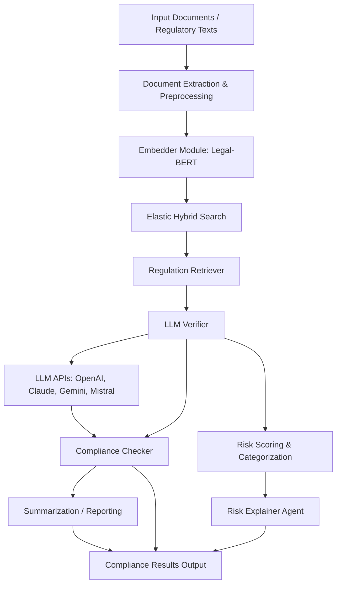

# SEBI Hack Backend: Compliance & Anomaly Detection Toolkit


A comprehensive AI-powered backend service for SEBI compliance verification, built with FastAPI and multiple LLM providers.

## Overview

This project provides a modular toolkit for compliance checking, anomaly detection, and document analysis, tailored for regulatory and financial domains. The core logic resides in the `src` folder, with supporting pre-trained models and indexes for fast, intelligent processing.

---

## Table of Contents
- [Features](#features)
- [Project Structure](#project-structure)
- [Installation](#installation)
- [Usage](#usage)
- [Modules](#modules)
- [Pre-trained Assets](#pre-trained-assets)
- [Contributing](#contributing)
- [License](#license)

---

## Features

### Core Features
- ✅ **FastAPI Backend Integration** - High-performance async API with automatic OpenAPI documentation
- ✅ **Multi-LLM Support** - Claude, Gemini, OpenAI, and Mistral integration for robust compliance verification
- ✅ **Document Processing Pipeline** - PDF text extraction, clause detection, and AI analysis
- ✅ **Compliance Verification** - Automated verification against SEBI regulations using semantic similarity
- ✅ **Risk Assessment** - Automated categorization and scoring of compliance risks
- ✅ **Anomaly Detection** - Machine learning-based outlier detection using Isolation Forest
- ✅ **Hybrid Search (Vector + Frequency)** - Fast semantic and keyword search using Elastic Hybrid Search
- ✅ **CORS Support** - Configured for seamless frontend integration
- ✅ **Health Monitoring** - Real-time backend status and performance monitoring

### AI & ML Features
- ✅ **Legal-BERT Embeddings** - Specialized legal language model for accurate semantic understanding
- ✅ **Multi-Provider LLM** - Fallback mechanisms and provider switching
- ✅ **Clause Classification** - Automated identification and categorization of legal clauses
- ✅ **Summarization Engine** - Generate concise summaries of lengthy documents

---

## Workflow Diagram


- **Clause Detection**: Identify and extract regulatory clauses from documents.
- **Anomaly Detection**: Detect outliers and suspicious patterns using Isolation Forest.
- **Compliance Checking**: Automated compliance verification against regulatory corpora.
- **LLM Integration**: Leverage large language models for advanced document understanding.
- **Summarization**: Generate concise summaries of lengthy documents.
- **Embedding & Retrieval**: Fast semantic and keyword search using Elastic Hybrid Search.

---


## Project Structure

```
SEBI-HACK/
│
├── (vector index stored in ElasticSearch)
├── isolation_forest.joblib
├── metadata.pkl
├── pyproject.toml
├── requirements.txt
├── README.md
├── my-app/
├── sebi-genai/
│   ├── pyvenv.cfg
│   ├── etc/
│   │   └── jupyter/
│   ├── Include/
│   │   └── site/
│   ├── Lib/
│   │   └── site-packages/
│   ├── Scripts/
│   │   ├── activate
│   │   ├── activate.bat
│   │   ├── Activate.ps1
│   │   ├── ...
│   └── share/
│       └── jupyter/
│
├── src/
│   ├── __init__.py
│   ├── Clause_detection.ipynb
│   ├── anomaly_detector/
│   │   ├── __init__.py
│   │   ├── ano_detector_agent.py
│   │   └── __pycache__/
│   ├── compliance_checker/
│   │   ├── __init__.py
│   │   ├── compliance_agent.py
│   │   ├── keywords_corpus.json
│   │   ├── llm_verifier.py
│   │   ├── regulation_retriever.py
│   │   ├── risk_explainer_agent.py
│   │   └── __pycache__/
│   ├── data/
│   │   ├── __init__.py
│   │   ├── dataset.ipynb
│   │   ├── __pycache__/
│   │   └── hf_data_providers/
│   ├── embedder/
│   │   ├── __init__.py
│   │   └── ...
│   ├── extraction/
│   │   └── ...
│   ├── llm_provider/
│   │   └── ...
│   ├── pipeline/
│   │   └── ...
│   ├── summerizer/
│   │   └── ...
│   └── sebi_hackathon_modules.egg-info/
│
└── app.py
```

---

## Installation

### Prerequisites
- **Python 3.11+**
- **Git** for version control
- **API Keys** for LLM providers (Gemini, Claude, OpenAI, Mistral)

### Quick Setup

1. **Clone the repository:**
   ```bash
   git clone https://github.com/nilam576/sebi-hack-final.git
   cd Sebi-Hack-Final/Backend
   ```

2. **Set up the virtual environment:**
   ```bash
   # Create virtual environment
   python -m venv venv

   # Activate virtual environment
   # Windows:
   venv\Scripts\activate
   # macOS/Linux:
   source venv/bin/activate
   ```

3. **Install dependencies:**
   ```bash
   pip install -r requirements.txt
   ```

4. **Environment Configuration:**
   ```bash
   # Create .env file
   cp .env.example .env

   # Edit .env with your API keys
   # Required: GEMINI_API_KEY
   # Optional: GEMINI_API_KEY_2, OPENAI_API_KEY, CLAUDE_API_KEY, MISTRAL_API_KEY
   ```

5. **Start the server:**
   ```bash
   # Development mode (with auto-reload)
   python start_server.py

   # Or production mode
   python app.py dev
   ```

---


## Usage

### Starting the Server

#### Production Mode (Recommended)
```bash
# Start with production settings
python start_server.py

# Server runs on: http://127.0.0.1:8000
# API Docs: http://127.0.0.1:8000/docs
# Health Check: http://127.0.0.1:8000/health
```

#### Development Mode
```bash
# Start with auto-reload for development
python app.py dev

# Or use uvicorn directly
uvicorn src.pipeline.run_pipeline:app --host 127.0.0.1 --port 8000 --reload
```

### API Endpoints

#### Core Endpoints
- **GET** `/` - API information and available endpoints
- **GET** `/health` - Server health check and status
- **POST** `/upload-pdf/` - Upload and process PDF documents
- **GET** `/docs` - Interactive API documentation (Swagger UI)
- **GET** `/redoc` - Alternative API documentation (ReDoc)

#### Document Processing
```bash
# Upload a PDF document
curl -X POST "http://127.0.0.1:8000/upload-pdf/" \
  -F "file=@document.pdf" \
  -F "lang=en"

# Check server health
curl http://127.0.0.1:8000/health

# Get API information
curl http://127.0.0.1:8000/
```

### Testing and Verification

#### Automated Testing
```bash
# Run comprehensive test suite
python test_server.py

# Test with sample documents
python test_minimal.py
```

#### Manual Testing
1. **Health Check**: Visit `http://127.0.0.1:8000/health`
2. **API Documentation**: Visit `http://127.0.0.1:8000/docs`
3. **Upload Test**: Use the interactive docs to test PDF upload

### Module Usage

#### Direct Module Usage
```python
from src.compliance_checker.compliance_agent import ComplianceAgent
from src.embedder.embeddings import LegalEmbedder

# Initialize components
embedder = LegalEmbedder()
compliance_checker = ComplianceAgent()

# Process documents
result = compliance_checker.verify_compliance(document_text)
```

#### Jupyter Notebook Exploration
- **Clause Detection**: `src/Clause_detection.ipynb`
- **Data Analysis**: `src/data/dataset.ipynb`
- **Model Training**: Explore training notebooks in `src/training/`

---

## Modules

### 1. `anomaly_detector/`
- Implements anomaly detection using machine learning (Isolation Forest).
- Key file: `ano_detector_agent.py`

### 2. `compliance_checker/`
- Automated compliance checking, regulation retrieval, and risk explanation.
- Key files: `compliance_agent.py`, `llm_verifier.py`, `regulation_retriever.py`, `risk_explainer_agent.py`, `keywords_corpus.json`

### 3. `data/`
- Data loading, preprocessing, and sample datasets.
- Includes `dataset.ipynb` for data exploration.

### 4. `embedder/`
- Embedding models for semantic search and document understanding. Embeddings are stored and queried via ElasticSearch's dense-vector capabilities to enable semantic similarity searches alongside traditional frequency/keyword queries.

### 5. `extraction/`
- Document extraction utilities (PDF, text, etc.).

### 6. `llm_provider/`
- Integration with large language models (OpenAI, HuggingFace, etc.).

### 7. `pipeline/`
- End-to-end pipelines combining multiple modules.

### 8. `summerizer/`
- Summarization logic for documents and regulatory texts.

---

## Pre-trained Assets / Hosted Resources

- **ElasticSearch Vector Index (hosted)**: We use a managed ElasticSearch cluster to store vector embeddings and document metadata. The index supports hybrid search combining dense-vector similarity and traditional frequency/keyword queries. The vector index is hosted in the cloud (see Deployment / Cloud below) rather than stored as a local binary file.
- **`isolation_forest.joblib`**: Pre-trained Isolation Forest model for anomaly detection.
- **`metadata.pkl`**: Metadata file (may include feature info, label mappings, or dataset statistics).

---

## Contributing

1. Fork the repository and create your branch.
2. Make your changes and add tests where appropriate.
3. Submit a pull request with a clear description of your changes.

---

## Configuration

### Environment Variables

Create a `.env` file in the Backend directory with the following variables:

```bash
# Required: Primary Gemini API Key
GEMINI_API_KEY=your_gemini_api_key_here

# Optional: Backup Gemini API Key
GEMINI_API_KEY_2=your_backup_gemini_key_here

# Required: ElasticSearch Configuration
ELASTICSEARCH_URL=your_elasticsearch_vectorstore_url_here
ELASTICSEARCH_API_KEY=your_elasticsearch_api_key_here

# Optional: Additional LLM Providers
OPENAI_API_KEY=your_openai_key_here
CLAUDE_API_KEY=your_claude_key_here
MISTRAL_API_KEY=your_mistral_key_here
```

### API Key Setup

1. **Google Gemini**: Get API key from [Google AI Studio](https://makersuite.google.com/app/apikey)
2. **OpenAI**: Get API key from [OpenAI Platform](https://platform.openai.com/api-keys)
3. **Claude**: Get API key from [Anthropic Console](https://console.anthropic.com/)
4. **Mistral**: Get API key from [Mistral AI](https://console.mistral.ai/)

### CORS Configuration

The backend is configured to accept requests from:
- `http://localhost:3000` (Frontend development)
- `http://localhost:3001` (Frontend development)
- `http://127.0.0.1:3000` (Frontend development)
- `http://127.0.0.1:3001` (Frontend development)

---

## Deployment / Cloud

- Our ElasticSearch cluster is hosted as a managed service on Google Cloud Platform (GCP). The backend connects to this cloud-hosted ElasticSearch instance for both dense-vector (semantic) search and traditional frequency/keyword queries. This allows scaling, automated backups, and secure access from the backend.

Ensure the following environment variables are set for secure access in production (or use your preferred secrets manager):

```
# ELASTICSEARCH_HOST - URL of the ElasticSearch endpoint (including protocol)
# ELASTICSEARCH_API_KEY or ELASTICSEARCH_USERNAME and ELASTICSEARCH_PASSWORD - credentials for the cluster
# ELASTICSEARCH_INDEX - name of the index used for documents and embeddings
```

## Troubleshooting

### Common Issues

**Server won't start:**
```bash
# Check Python version
python --version

# Verify virtual environment activation
which python

# Check dependencies
pip list | grep fastapi
```

**API Key errors:**
```bash
# Verify .env file exists and contains correct keys
cat .env

# Test API key validity
python -c "import google.generativeai as genai; genai.configure(api_key='your_key_here')"
```

**CORS errors:**
- Ensure frontend is running on allowed origin
- Check CORS middleware configuration in `app.py`

**Document processing errors:**
- Verify PDF file is not corrupted
- Check file size limits
- Ensure proper file format

---

## Contributing

1. Fork the repository
2. Create a feature branch (`git checkout -b feature/amazing-feature`)
3. Commit your changes (`git commit -m 'Add amazing feature'`)
4. Push to the branch (`git push origin feature/amazing-feature`)
5. Open a Pull Request

### Development Guidelines
- Follow PEP 8 style guidelines
- Add type hints for better code quality
- Write comprehensive docstrings
- Add unit tests for new features
- Update documentation for API changes

---

## License

This project is licensed under the MIT License. See [LICENSE](LICENSE) for details.

---

**Built with ❤️ for SEBI Compliance - September 2025**
