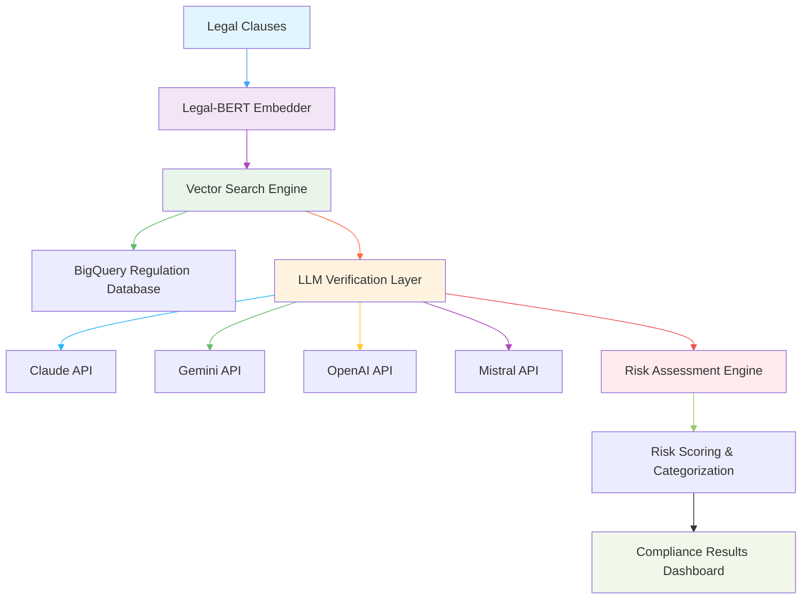

# SEBI Compliance Verification System

An AI-powered legal document compliance verification system that analyzes clauses against SEBI regulations using multiple LLM providers and semantic similarity search.

## 🚀 Features

- **Multi-LLM Support**: Claude, Gemini, OpenAI, and Mistral integration for robust compliance verification
- **Legal-BERT Embeddings**: Specialized legal language model for accurate semantic understanding
- **Vector Similarity Search**: BigQuery-powered regulation retrieval using cosine similarity
- **Risk Assessment**: Automated categorization and scoring of compliance risks
- **Cloud-Native**: Built on Google Cloud Platform for scalability
- **Modern UI**: Next.js 14 with TypeScript, Tailwind CSS, and Shadcn UI components

## 🏗️ Architecture



The system processes legal documents through a multi-stage pipeline:
1. **Embedding**: Converts clauses to vectors using Legal-BERT
2. **Retrieval**: Finds similar regulations from BigQuery vector database  
3. **Verification**: Uses LLMs to verify compliance against retrieved rules
4. **Risk Scoring**: Categorizes and quantifies potential risks

## 📋 Prerequisites

- **Python 3.12+** (Backend)
- **Node.js 18+** with **pnpm** (Frontend - recommended package manager)
- **Google Cloud Platform** account with BigQuery and Storage access
- **API keys** for chosen LLM providers (Claude, Gemini, OpenAI, Mistral)

## 🔐 Authentication & Security

### Protected Routes
- **Dashboard Access**: `/dashboard/*` routes require authentication
- **Middleware Protection**: Automatic redirect to login for unauthenticated users
- **Demo Credentials**: Available for testing and development

### Login Process
1. Navigate to the login page (`/login`)
2. Use the following demo credentials:
   - **Email**: `Test-01@gmail.com`
   - **Password**: `12345678`
3. Upon successful login, you'll be redirected to `/dashboard`
4. The authentication token is stored as an HTTP cookie

### Security Features
- **Rate Limiting**: 100 requests per hour per IP
- **CSRF Protection**: Tokens required for state-changing operations
- **Content-Type Validation**: Strict validation for API requests
- **Security Headers**: Comprehensive security headers applied to all responses

### Development Mode
For easier development and testing, you can skip authentication by setting:
```bash
# In .env.local file
NEXT_PUBLIC_SKIP_AUTH=true
```

When `NEXT_PUBLIC_SKIP_AUTH=true` is set, the middleware will allow direct access to `/dashboard` without requiring login.

## 🔧 Installation

### Backend Setup

1. Navigate to Backend directory:
```bash
cd Backend
```

2. Install dependencies (Poetry recommended):
```bash
# Using Poetry
poetry install
poetry shell

# Or using pip
pip install -r requirements.txt
```

3. Set up environment variables:
```bash
# Create .env file in Backend directory
cp .env.example .env

# Edit .env with your credentials:
GCP_PROJECT_ID=your-gcp-project-id
GCP_DATASET=your-bigquery-dataset
GCP_EMBEDDINGS_BUCKET=your-bigquery-table
ANTHROPIC_KEY=your-anthropic-api-key
GOOGLE_API_KEY=your-google-api-key
```

4. Run the backend server:
```bash
poetry run uvicorn src.main:app --reload
# API available at http://localhost:8080
```

### Frontend Setup

1. Navigate to Frontend directory:
```bash
cd Frontend
```

2. Install dependencies (pnpm recommended for performance):
```bash
pnpm install
# or npm install (slower)
# or yarn install
```

3. Set up environment variables:
```bash
# Create .env.local file
echo "NEXT_PUBLIC_API_URL=http://localhost:8080" > .env.local
```

4. Run the development server:
```bash
pnpm dev
# Frontend available at http://localhost:3000
```

## 🚦 Quick Start

Once both Backend and Frontend are running:

1. **Access the application**: http://localhost:3000

2. **Login to Dashboard**:
   - Click "Start Free Analysis" or navigate to `/login`
   - Use demo credentials:
     - **Email**: `Test-01@gmail.com`
     - **Password**: `12345678`
   - After login (7-second delay), you'll be redirected to the dashboard

3. **Upload documents** using the drag-and-drop interface
4. **View compliance results** in the interactive dashboard
5. **Analyze risk assessments** with visual charts
6. **Export reports** for further analysis

### Dashboard Features

The dashboard provides comprehensive compliance analysis with the following features:

- **Document Management**: Upload, track, and manage legal documents
- **Clause Analysis**: Detailed examination of individual contract clauses
- **Compliance Scoring**: Overall document compliance percentages and risk levels
- **Visual Analytics**: Interactive charts showing compliance trends and risk distributions
- **Export Functionality**: Export detailed compliance reports in multiple formats:
  - **JSON**: Complete structured data export with all compliance results
  - **CSV**: Spreadsheet-friendly format for clause-by-clause analysis
  - **PDF**: Professionally formatted report for sharing and archival purposes

The JSON export contains a comprehensive data structure with:
- Document summaries and metadata
- Clause-by-clause compliance analysis
- Risk assessments with severity ratings
- Detailed explanations for each compliance determination
- Timeline information for regulatory requirements

The PDF export provides a professionally formatted report with:
- Cover page with document information
- Executive summary
- Compliance statistics and visual charts
- Detailed clause-by-clause analysis
- Risk assessments with mitigation strategies
- Key timelines
- Appendix with full clause texts
- Page headers, footers, and numbering

### API Usage Example

```bash
# Verify compliance via REST API
curl -X POST "http://localhost:8080/api/v1/compliance/verify" \
  -H "Content-Type: application/json" \
  -d '{
    "clauses": [
      {
        "id": "clause_1",
        "text_en": "The company shall maintain records for a period of 5 years.",
        "metadata": {"document": "contract.pdf", "section": "data_retention"}
      }
    ],
    "llm_provider": "gemini",
    "options": {
      "include_explanations": true,
      "risk_assessment": true
    }
  }'
```

## 📊 Core Components

### ComplianceAgent
Main orchestrator that coordinates the compliance verification workflow.

### LegalBERTEmbedder  
Generates semantic embeddings using the `nlpaueb/legal-bert-base-uncased` model.

### RegulationRetriever
Retrieves relevant SEBI regulations from BigQuery using vector similarity search.

### LLMVerifier
Supports multiple LLM providers for compliance verification with structured outputs.

### RiskExplainer
Categorizes risks by severity (Low/Medium/High) and type (Legal/Financial/Operational).

## 🔍 Model Training

The system includes a Jupyter notebook for training clause classification models:

```bash
jupyter notebook "src/Clause detection.ipynb"
```

This notebook demonstrates:
- Loading legal clause datasets from Google Cloud Storage
- Fine-tuning DistilBERT for clause type classification
- Risk scoring and evaluation metrics

## 📁 Project Structure

```
SEBI-HACK/
├── Backend/                           # Python/FastAPI backend
│   ├── src/
│   │   ├── api/v1/                   # FastAPI routers (endpoints)
│   │   ├── core/                     # Core app setup & config
│   │   │   ├── config.py             # Environment settings (Pydantic)
│   │   │   └── logging.py            # Logging configuration
│   │   ├── services/                 # Business/domain logic (migrated)
│   │   │   ├── compliance_checker/   # Original compliance logic
│   │   │   ├── embedder/             # Legal-BERT embeddings
│   │   │   └── training/             # Model training utilities
│   │   ├── models/                   # Pydantic schemas & API models
│   │   ├── db/                       # Database / BigQuery adapters
│   │   ├── llm_provider/             # Multi-LLM integrations
│   │   └── training/                 # ML training scripts & notebooks
│   ├── tests/                        # Backend tests (pytest)
│   ├── pyproject.toml                # Poetry dependency management
│   ├── requirements.txt              # Pip requirements (legacy)
│   └── README.md                     # Backend documentation
│
├── Frontend/                         # Next.js 14 frontend
│   ├── app/
│   │   ├── (auth)/                   # Auth route group (login, signup)
│   │   ├── dashboard/                # Dashboard route group
│   │   ├── api/                      # Next.js API routes (BFF layer)
│   │   ├── layout.tsx                # Root layout
│   │   └── globals.css               # Global styles
│   ├── components/                   # Shared UI components
│   ├── features/                     # Feature-based organization
│   │   ├── compliance-dashboard/     # Dashboard components & hooks
│   │   └── document-upload/          # Upload components & hooks
│   ├── hooks/                        # Global React hooks
│   ├── lib/                          # Client utilities (API, GSAP)
│   ├── styles/                       # Tailwind & additional CSS
│   ├── public/                       # Static assets
│   ├── tests/                        # Frontend tests (Playwright/Jest)
│   ├── package.json                  # Frontend dependencies
│   ├── next.config.js               # Next.js configuration
│   ├── tailwind.config.js           # Tailwind CSS config
│   └── README.md                     # Frontend documentation
│
├── docs/                             # Project documentation
│   ├── QWEN.md                       # Qwen Code guidance
│   ├── plan.md                       # Development roadmap
│   └── README.md                     # This file
│
├── src/                              # Original source code (legacy)
│   ├── compliance_checker/           # → Migrated to Backend/src/services/
│   ├── embedder/                     # → Migrated to Backend/src/services/
│   ├── llm_provider/                 # → Migrated to Backend/src/llm_provider/
│   ├── training/                     # → Migrated to Backend/src/training/
│   └── Clause detection.ipynb       # → Migrated to Backend/src/training/
│
├── sebi-genai/                       # Python virtual environment (legacy)
├── requirements.txt                  # → Migrated to Backend/
└── my-app/                           # Empty directory (cleanup needed)
```

## Recent Enhancements (October 2025)

### Frontend Improvements
- **Enhanced Authentication**: Improved login/signup flow with better validation and error handling
- **Responsive Navigation**: Updated navbar with better mobile support and accessibility
- **Dashboard Updates**: Enhanced statistics display and real-time processing updates
- **UI/UX Refinements**: Improved form handling and user feedback throughout the application
- **Performance Optimization**: Code splitting, lazy loading, and bundle size optimization
- **Export Functionality**: Comprehensive PDF, JSON, and CSV export capabilities
- **Error Boundaries**: Global error handling with graceful fallbacks

### Backend Improvements
- **API Performance**: Optimized endpoints for faster response times and reduced latency
- **Error Handling**: Enhanced error reporting and logging with detailed error messages
- **Security**: Improved authentication and authorization mechanisms
- **Health Monitoring**: Real-time backend status monitoring and connectivity checks
- **CORS Configuration**: Seamless integration with frontend applications
- **Multi-LLM Support**: Robust fallback mechanisms and provider switching

## 🛡️ Security Notes

- Store API keys in environment variables, not in code
- Ensure BigQuery tables have appropriate IAM policies
- Legal documents contain sensitive information - implement proper access controls

## 🤝 Contributing

1. Fork the repository
2. Create a feature branch: `git checkout -b feature-name`
3. Make your changes and add tests
4. Commit changes: `git commit -m 'Add feature'`
5. Push to branch: `git push origin feature-name`
6. Submit a pull request

## 📄 License

This project is licensed under the MIT License - see the LICENSE file for details.

## 🆘 Support

For questions or issues, please open a GitHub issue or contact the development team.